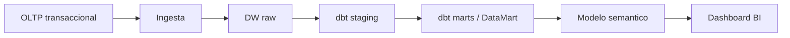

# PLANTILLA - PRODUCTO DEL CURSO / PRODUCTO U3: Solucion BI end-to-end

Producto del curso:

```text
Solucion BI end-to-end para toma de decisiones, con origen transaccional,
Data Warehouse/DataMart, pipeline de ingesta y transformacion, modelo semantico,
dashboard interactivo, validacion de KPIs, trazabilidad y sustentacion tecnica.
```

Esta plantilla integra el trabajo realizado en las tres unidades:

- **U1:** requerimientos BI, KPIs, modelo dimensional y mockup.
- **U2:** DataMart, pipeline de ingesta y transformacion, modelo semantico, visualizaciones y validacion.
- **U3:** integracion end-to-end, validacion con negocio, trazabilidad y sustentacion final.

El entregable debe demostrar que la solucion BI funciona desde la fuente transaccional hasta el dashboard, y que sus KPIs son confiables para apoyar decisiones de negocio.

---

## 1. Datos generales del proyecto

**Nombre del proyecto BI:**  

**Equipo:**  

**Integrantes:**  

**Proceso de negocio analizado:**  

**Fuente transaccional usada:**  

**Herramientas utilizadas:**  

| Componente | Herramienta / tecnologia | Evidencia |
| --- | --- | --- |
| OLTP | MySQL / PostgreSQL / otro |  |
| Ingesta | Debezium + Kafka / Airbyte / otro |  |
| DW / DataMart | PostgreSQL / otro |  |
| Transformacion | dbt / SQL / otro |  |
| Modelo semantico | Power BI / otro |  |
| Dashboard | Power BI / otro |  |
| Validacion | SQL / dbt test / Power BI |  |

---

## 2. Resumen ejecutivo

Redactar una sintesis de media pagina como maximo.

Debe responder:

1. Que problema de negocio se analizo?
2. Que decisiones busca mejorar la solucion BI?
3. Que datos se usaron?
4. Que componentes tecnicos se implementaron?
5. Que hallazgos principales se obtuvieron?
6. Que decision recomienda el equipo?

---

## 3. Problema de negocio y objetivo analitico

### 3.1 Problema de negocio heredado de U1

| Elemento | Descripcion |
| --- | --- |
| Area o proceso involucrado |  |
| Problema identificado |  |
| Usuarios principales |  |
| Decisiones que se buscan mejorar |  |
| Impacto esperado |  |

### 3.2 Objetivo analitico

```text
El objetivo analitico del proyecto es...
```

### 3.3 Preguntas de negocio

| Pregunta de negocio | KPI relacionado | Usuario | Visual del dashboard |
| --- | --- | --- | --- |
|  |  |  |  |
|  |  |  |  |
|  |  |  |  |

---

## 4. KPIs principales

| KPI | Definicion | Formula de negocio | Fuente | Frecuencia | Usuario |
| --- | --- | --- | --- | --- | --- |
| Ventas Netas |  |  |  |  |  |
| Margen Bruto |  |  |  |  |  |
| Pedidos |  |  |  |  |  |
| Ticket Promedio |  |  |  |  |  |
| % Pedidos a Tiempo |  |  |  |  |  |

### 4.1 Criterios de interpretacion

| KPI | Bajo | Esperado | Alto / cumplido | Accion sugerida |
| --- | --- | --- | --- | --- |
|  |  |  |  |  |
|  |  |  |  |  |

---

## 5. Arquitectura BI implementada

Representar el flujo construido.

```text
OLTP MySQL
  -> Ingesta Debezium + Kafka / Airbyte
  -> PostgreSQL DW raw
  -> dbt staging
  -> dbt marts
  -> Power BI modelo semantico
  -> Dashboard interactivo
```

### 5.1 Diagrama de arquitectura

Agregar diagrama o captura de la arquitectura.



### 5.2 Componentes implementados

| Componente | Descripcion | Estado | Evidencia |
| --- | --- | --- | --- |
| Base transaccional OLTP |  | Completo / parcial |  |
| Ingesta |  | Completo / parcial |  |
| Capa raw |  | Completo / parcial |  |
| Capa staging |  | Completo / parcial |  |
| Capa marts |  | Completo / parcial |  |
| Modelo semantico |  | Completo / parcial |  |
| Dashboard |  | Completo / parcial |  |

---

## 6. Fuente transaccional OLTP

### 6.1 Tablas utilizadas

| Tabla OLTP | Descripcion | Campos principales | Uso analitico |
| --- | --- | --- | --- |
| clientes |  |  |  |
| productos |  |  |  |
| pedidos |  |  |  |
| pedido_detalles |  |  |  |
| vendedores |  |  |  |

### 6.2 Evidencia del origen

Incluir capturas o consultas que demuestren:

- Tablas transaccionales existentes.
- Cantidad de registros.
- Relaciones principales.
- Datos de ejemplo.

```sql
-- Consultas de evidencia del origen transaccional
```

---

## 7. Pipeline de ingesta y transformacion

### 7.1 Ingesta

| Origen | Destino | Herramienta | Tipo de carga | Estado |
| --- | --- | --- | --- | --- |
| OLTP | raw | Debezium + Kafka / Airbyte | Full / incremental / CDC |  |

### 7.2 Capas de datos

| Capa | Equivalencia | Proposito | Evidencia |
| --- | --- | --- | --- |
| raw | Bronze | Datos replicados desde el OLTP |  |
| staging | Silver | Datos limpiados, renombrados y estandarizados |  |
| marts | Gold | Dimensiones y hechos listos para analisis |  |

### 7.3 Modelos de transformacion

| Modelo | Capa | Fuente | Transformacion aplicada | Resultado |
| --- | --- | --- | --- | --- |
| stg_clientes | staging | raw |  |  |
| stg_productos | staging | raw |  |  |
| stg_pedidos | staging | raw |  |  |
| dim_cliente | marts | staging |  |  |
| dim_producto | marts | staging |  |  |
| fact_ventas | marts | staging |  |  |

### 7.4 Evidencia de ejecucion

| Evidencia | Descripcion | Estado |
| --- | --- | --- |
| Job o sincronizacion de ingesta |  |  |
| Tablas creadas en raw |  |  |
| Ejecucion de `dbt run` |  |  |
| Ejecucion de `dbt test` |  |  |
| Modelos creados en marts |  |  |

---

## 8. Data Warehouse / DataMart

### 8.1 Modelo dimensional

**Tabla de hechos principal:**  

**Grano de la tabla de hechos:**  

**Dimensiones implementadas:**  

| Tabla | Tipo | Descripcion | Clave principal | KPI soportado |
| --- | --- | --- | --- | --- |
| dim_fecha | Dimension |  |  |  |
| dim_producto | Dimension |  |  |  |
| dim_cliente | Dimension |  |  |  |
| dim_vendedor | Dimension |  |  |  |
| fact_ventas | Hecho |  |  |  |

### 8.2 Diagrama del modelo

Insertar imagen o captura del modelo estrella.

### 8.3 Reglas de negocio aplicadas

| Regla | Tabla / campo | Descripcion | KPI afectado |
| --- | --- | --- | --- |
|  |  |  |  |
|  |  |  |  |

---

## 9. Modelo semantico en Power BI

### 9.1 Relaciones

| Tabla dimension | Tabla hecho | Campo dimension | Campo hecho | Cardinalidad | Direccion de filtro |
| --- | --- | --- | --- | --- | --- |
| dim_fecha | fact_ventas |  |  | 1:* |  |
| dim_producto | fact_ventas |  |  | 1:* |  |
| dim_cliente | fact_ventas |  |  | 1:* |  |
| dim_vendedor | fact_ventas |  |  | 1:* |  |

### 9.2 Medidas DAX

| Medida | Formula DAX | Formato | KPI asociado |
| --- | --- | --- | --- |
| Ventas Netas |  | Moneda | Ventas Netas |
| Margen Bruto |  | Moneda | Margen Bruto |
| Pedidos |  | Entero | Pedidos |
| Ticket Promedio |  | Moneda | Ticket Promedio |
| % Margen |  | Porcentaje | Rentabilidad |

```DAX
-- Pegar aqui las medidas DAX principales
```

### 9.3 Jerarquias y campos de analisis

| Jerarquia | Niveles | Tabla | Uso analitico |
| --- | --- | --- | --- |
| Calendario | Anio, trimestre, mes, dia | dim_fecha | Analisis temporal |
| Producto | Familia, categoria, producto | dim_producto | Analisis comercial |
| Cliente | Segmento, cliente | dim_cliente | Analisis de clientes |

---

## 10. Dashboard interactivo

### 10.1 Paginas del dashboard

| Pagina | Objetivo | Visuales principales | Filtros |
| --- | --- | --- | --- |
| Resumen ejecutivo | Mostrar KPIs principales | Tarjetas, lineas, barras | Fecha, producto |
| Ventas | Analizar evolucion comercial | Lineas, barras, matriz | Fecha, vendedor |
| Productos | Evaluar desempeno de productos | Ranking, matriz | Categoria, familia |
| Clientes | Analizar comportamiento de clientes | Ranking, segmentacion | Cliente, zona |

### 10.2 Interactividad implementada (opcional)

| Funcionalidad | Pagina / visual | Proposito | Evidencia |
| --- | --- | --- | --- |
| Segmentadores |  |  |  |
| Drill-down |  |  |  |
| Drill-through |  |  |  |
| Tooltips |  |  |  |
| Navegacion entre paginas |  |  |  |

Estas funcionalidades mejoran la experiencia del dashboard, pero no reemplazan las actividades obligatorias de comparativos, KPIs y validacion.

### 10.3 Comparativos y KPIs obligatorios del dashboard

El dashboard final debe incluir visuales equivalentes a los comparativos trabajados durante el curso. No es obligatorio que todos los equipos usen ventas; pueden aplicar la misma logica sobre cantidades, pedidos, unidades, atenciones, incidencias, costos, margen u otra metrica principal del caso.

Estos comparativos deben construirse usando la dimension fecha del Data Warehouse/DataMart y medidas del modelo semantico, controlando correctamente el contexto de filtros del dashboard.

| Actividad obligatoria | Objetivo | Evidencia esperada |
| --- | --- | --- |
| Comparativo del periodo actual vs mismo periodo del anio anterior | Comparar la metrica principal del periodo seleccionado contra el mismo periodo del anio anterior | Matriz de control, segmentador de anio, grafico mensual o por periodo, tarjetas, KPI comparativo y validacion SQL |
| Comparativo del periodo actual vs periodo anterior | Comparar la metrica principal del mes, semana o periodo seleccionado contra el periodo inmediatamente anterior | Segmentadores de anio y periodo, matriz de control, tarjetas comparativas, grafico de tendencia, KPI comparativo y validacion SQL |
| Tabla KPI de variacion por dimension de negocio | Analizar variacion absoluta y porcentual de la metrica principal por una o mas dimensiones relevantes | Tabla o matriz KPI por anio, categoria, producto, cliente, sede, area u otra dimension; iconos o formato condicional; validacion SQL |

### 10.4 Capturas obligatorias

Agregar capturas de:

- Vista general del dashboard.
- Filtros o segmentadores.
- KPIs principales.
- Visuales por tiempo, producto, cliente o vendedor.
- Comparativo de la metrica principal actual vs mismo periodo del anio anterior.
- Comparativo de la metrica principal actual vs periodo anterior.
- Tabla KPI de variacion por una dimension de negocio relevante.
- Interacciones relevantes, si fueron implementadas.

---

## 11. Validacion de KPIs

### 11.1 Conciliacion SQL vs Power BI

| KPI | Resultado SQL DataMart | Resultado Power BI | Diferencia | Estado |
| --- | ---: | ---: | ---: | --- |
| Ventas Netas |  |  |  | Correcto / revisar |
| Margen Bruto |  |  |  | Correcto / revisar |
| Pedidos |  |  |  | Correcto / revisar |
| Ticket Promedio |  |  |  | Correcto / revisar |
| % Pedidos a Tiempo |  |  |  | Correcto / revisar |

### 11.2 Consultas de validacion

```sql
-- Pegar aqui las consultas SQL usadas para validar los KPIs
```

### 11.3 Hallazgos de validacion

| Hallazgo | Causa | Ajuste aplicado | Evidencia posterior | Estado |
| --- | --- | --- | --- | --- |
|  |  |  |  |  |
|  |  |  |  |  |

---

## 12. Trazabilidad fuente-modelo-KPI-dashboard

| KPI | Fuente OLTP | Capa raw | Modelo staging | Tabla DataMart | Medida BI | Visual |
| --- | --- | --- | --- | --- | --- | --- |
| Ventas Netas |  |  |  | fact_ventas |  |  |
| Margen Bruto |  |  |  | fact_ventas |  |  |
| Pedidos |  |  |  | fact_ventas |  |  |
| Ticket Promedio |  |  |  | fact_ventas |  |  |
| % Pedidos a Tiempo |  |  |  | fact_ventas |  |  |

---

## 13. Calidad de datos y gobierno minimo

### 13.1 Controles aplicados

| Control | Tabla / campo | Regla esperada | Resultado | Estado |
| --- | --- | --- | --- | --- |
| Completitud |  | No debe tener nulos criticos |  |  |
| Unicidad |  | Claves sin duplicados |  |  |
| Integridad referencial |  | FK validas entre hecho y dimensiones |  |  |
| Consistencia |  | Montos y cantidades coherentes |  |  |
| Rango valido |  | Fechas, precios o cantidades dentro de rango |  |  |

### 13.2 Reglas de gobierno documentadas

| Elemento | Regla / definicion | Responsable |
| --- | --- | --- |
| Definicion de KPI |  |  |
| Fuente oficial |  |  |
| Frecuencia de actualizacion |  |  |
| Criterio de calidad |  |  |

---

## 14. Hallazgos, interpretacion y decision recomendada

| Hallazgo | Evidencia en dashboard | Interpretacion | Decision recomendada |
| --- | --- | --- | --- |
|  |  |  |  |
|  |  |  |  |
|  |  |  |  |

### 14.1 Decision final propuesta

```text
Con base en los KPIs y visuales analizados, el equipo recomienda...
```

---

## 15. Sustentacion tecnica

Responder brevemente:

1. Como fluye el dato desde el OLTP hasta el dashboard?
2. Que transformaciones principales se aplicaron?
3. Por que se eligio ese modelo dimensional?
4. Como se valido que los KPIs son correctos?
5. Que problema tecnico se presento y como se resolvio?
6. Que limitaciones tiene la solucion actual?
7. Que mejoras se implementarian en una siguiente version?

---

## 16. Evidencias obligatorias

| Evidencia | Formato sugerido | Estado |
| --- | --- | --- |
| Repositorio organizado | enlace / captura |  |
| Base OLTP operativa | captura / consulta |  |
| Ingesta funcionando | captura Debezium, Kafka, Airbyte o log |  |
| Tablas raw en DW | captura / SQL |  |
| Modelos staging | archivos dbt / SQL |  |
| DataMart marts | tablas / captura / SQL |  |
| Modelo dimensional | diagrama / captura |  |
| Modelo semantico Power BI | captura |  |
| Medidas DAX | tabla / captura |  |
| Dashboard interactivo | `.pbix` / captura |  |
| Comparativo metrica actual vs mismo periodo del anio anterior | pagina Power BI / captura / SQL |  |
| Comparativo metrica actual vs periodo anterior | pagina Power BI / captura / SQL |  |
| Tabla KPI de variacion por dimension de negocio | pagina Power BI / captura / SQL |  |
| Validacion SQL vs Power BI | tabla comparativa |  |
| Trazabilidad de KPIs | matriz |  |
| Aporte individual | tabla |  |

---

## 17. Aporte individual del equipo

| Integrante | Componentes trabajados | Evidencia | Que valido | Que sustentara |
| --- | --- | --- | --- | --- |
|  |  |  |  |  |
|  |  |  |  |  |
|  |  |  |  |  |

Cada estudiante debe poder responder:

```text
Que construiste?
Que archivo, consulta o captura lo demuestra?
Como sabes que funciona?
Que decision tecnica tomaste?
Que mejorarias?
```

---

## 18. Conclusiones

Redactar de 3 a 5 conclusiones sobre:

- Valor de negocio de la solucion BI.
- Calidad y confiabilidad de los datos.
- Utilidad del dashboard para la toma de decisiones.
- Aprendizajes tecnicos del pipeline end-to-end.
- Mejoras futuras.

---

# Entregables finales

El equipo debe entregar:

1. Informe en PDF usando esta plantilla.
2. Archivo Power BI `.pbix`.
3. Repositorio o carpeta del proyecto.
4. Scripts SQL y/o proyecto dbt.
5. Evidencias de ingesta, transformacion y validacion.
6. Presentacion o demo para sustentacion.

Nombre sugerido:

```text
PRODUCTO_CURSO_BI_Equipo##_NombreProyecto.pdf
```

---

# Rubrica de Evaluacion del Producto del Curso / Unidad 3

| Criterio | N3 - Logro alto | N2 - Esperado | N1 - En proceso | N0 - Deficiente |
| --- | --- | --- | --- | --- |
| 1. Integracion end-to-end | Demuestra flujo completo desde OLTP hasta dashboard, con evidencias claras de cada componente | El flujo funciona, pero alguna evidencia o conexion esta incompleta | La integracion es parcial o requiere pasos no demostrados | No demuestra flujo end-to-end |
| 2. Arquitectura BI | Presenta arquitectura coherente, separando OLTP, ingesta, DW/DataMart, modelo semantico y consumo BI | Arquitectura clara con detalles menores incompletos | Arquitectura confusa o poco justificada | No presenta arquitectura |
| 3. DataMart y modelo dimensional | DataMart consistente con hechos, dimensiones, grano, claves y reglas de negocio bien documentadas | DataMart funcional con errores menores | Modelo incompleto o con inconsistencias importantes | No presenta DataMart valido |
| 4. Pipeline de ingesta y transformacion | Ingesta y transformacion funcionan, con evidencia de raw, staging, marts, ejecucion y pruebas | Pipeline funcional con evidencia parcial | Pipeline incompleto o poco verificable | No presenta pipeline |
| 5. Modelo semantico y dashboard | Power BI presenta relaciones correctas, medidas DAX y visuales alineados al negocio | Dashboard funcional con errores menores o interactividad opcional incompleta | Dashboard incompleto o con medidas poco confiables | No presenta dashboard funcional |
| 6. Graficos comparativos y tabla KPI | Incluye comparativo de metrica actual vs mismo periodo del anio anterior, comparativo vs periodo anterior y tabla KPI de variacion por dimension de negocio, todos validados y coherentes con la dimension fecha del DataMart | Incluye los comparativos principales, pero con evidencia, diseno o validacion parcial | Presenta solo un comparativo o los graficos no permiten interpretar claramente la variacion | No presenta graficos comparativos ni tabla KPI de variacion |
| 7. Validacion de KPIs | Concilia SQL vs Power BI, documenta diferencias, aplica ajustes y demuestra consistencia | Valida KPIs principales con cobertura parcial | Validacion superficial o solo con capturas aisladas | No valida KPIs |
| 8. Trazabilidad y calidad de datos | Evidencia trazabilidad fuente-modelo-KPI-visual y controles de calidad relevantes | Presenta trazabilidad o calidad con detalle parcial | Trazabilidad debil o controles insuficientes | No evidencia trazabilidad ni calidad |
| 9. Interpretacion y toma de decisiones | Presenta hallazgos claros y una decision recomendada sustentada en datos | Presenta hallazgos, pero la decision es poco profunda | Interpretacion descriptiva sin decision clara | No interpreta resultados |
| 10. Sustentacion tecnica | Explica decisiones tecnicas, problemas resueltos, limitaciones y mejoras con dominio | Sustenta la solucion con vacios menores | Sustentacion insegura o dependiente de pocos integrantes | No sustenta tecnicamente |
| 11. Aporte individual | Cada integrante evidencia aportes verificables y equilibrados | La mayoria evidencia aportes | Participacion desigual o poco verificable | No se evidencia aporte individual |
