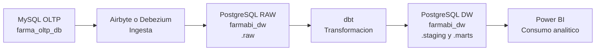

# farmabi - Business Intelligence

`farmabi` es un laboratorio BI para construir un flujo completo desde una base transaccional hasta un modelo analitico consumible en Power BI.

```text
MySQL OLTP -> Airbyte o Debezium -> PostgreSQL RAW -> dbt -> PostgreSQL DW -> Power BI
```

## Arquitectura global



## Modulos

| Modulo | Rol |
|---|---|
| `oltp-mysql/` | Origen transaccional MySQL (base `farma_oltp_db`) |
| `dw-pg/` | PostgreSQL analitico (base `farmabi_dw`) |
| `ingesta-airbyte/` | Replica MySQL -> PostgreSQL via Airbyte |
| `ingesta-debezium/` | CDC con Debezium + Kafka (replicacion en tiempo real) |
| `dw-dbt/` | Transformacion con dbt: staging -> marts |
| `powerbi/` | Consumo analitico: .pbix, medidas DAX, dashboards |
| `docs/` | Libro digital MkDocs con sesiones y guias |

## Orden recomendado

1. `oltp-mysql/`
2. `dw-pg/`
3. `ingesta-airbyte/` o `ingesta-debezium/`
4. `dw-dbt/`
5. `powerbi/`

## Requisitos

- Docker Engine + Docker Compose plugin
- (Opcional) `abctl` para Airbyte
- Power BI Desktop para visualizacion
