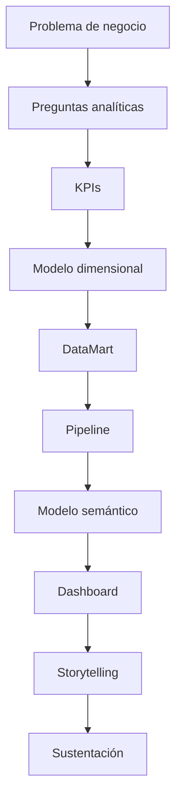

# Proyecto Sello de Inteligencia de Negocios

## 1. Propósito

El Proyecto Sello integra las sesiones de **Inteligencia de Negocios** alrededor de una solución analítica end-to-end. El curso parte de una necesidad de decisión y culmina en un flujo BI completo con datos, modelo, KPIs, dashboard, trazabilidad y sustentación técnica.

```text
Problema de negocio -> KPIs -> Modelo dimensional -> DataMart -> Pipeline -> Modelo semántico -> Dashboard -> Decisión
```

## 2. El Proyecto

Durante el semestre desarrollarás una **solución BI end-to-end para la toma de decisiones**.

El proyecto debe convertir un problema de negocio en requerimientos analíticos, KPIs, modelo dimensional, Data Warehouse/DataMart, pipeline de ingesta y transformación, modelo semántico, dashboard interactivo y narrativa ejecutiva.

No se considera Proyecto Sello:

- Un dashboard sin problema de negocio.
- Gráficos sin KPIs definidos.
- Un modelo dimensional sin trazabilidad hacia fuentes y decisiones.
- Datos cargados sin validación de consistencia.
- Reportes visuales que no generan interpretación ni recomendación.
- Una solución que el estudiante no pueda defender desde la fuente hasta el KPI.

## 3. Evolución del Proyecto

| Unidad | Temas principales | Evolución del proyecto |
|---|---|---|
| Unidad 1 | Problema de negocio, requerimientos analíticos, KPIs, modelo dimensional, metadata y mockup. | Diseño funcional y analítico de la solución BI. |
| Unidad 2 | DataMart, pipeline, transformaciones, modelo semántico, medidas, visualizaciones y gobierno del dato. | Solución BI implementada y validada técnicamente. |
| Unidad 3 | Integración end-to-end, validación con negocio, trazabilidad y demo técnica. | Solución BI final orientada a decisiones. |



### Alineamiento por sesiones

Este alineamiento muestra cómo la solución BI pasa de una necesidad de decisión a un producto analítico validado y defendible.

| Sesiones | Contenido central | Avance del proyecto |
|---|---|---|
| S1-S2 | Problema de negocio, preguntas analíticas, requerimientos y KPIs. | Brief analítico con decisiones, usuarios, KPIs iniciales y alcance. |
| S3-S4 | Modelado dimensional, metadata, trazabilidad, mockup y consumo analítico. | Diseño BI con hecho, grano, dimensiones, KPIs y propuesta de dashboard. |
| S5 | Evaluación U1. | Documento de diseño BI validado como base de construcción. |
| S6-S7 | DataMart manual, ETL, ingesta, CDC, dbt y carga incremental. | Pipeline y repositorio analítico implementados con evidencias. |
| S8-S10 | Modelo semántico, medidas, visualizaciones y paneles interactivos. | Power BI con relaciones, DAX, KPIs, filtros e interacción analítica. |
| S11-S12 | Storytelling, trazabilidad, gobierno del dato y evaluación U2. | Solución BI construida, validada y presentada con evidencias técnicas. |
| S13-S14 | Integración end-to-end, validación con negocio y consistencia de datos. | Flujo completo desde fuente transaccional hasta dashboard validado. |
| S15-S16 | Sustentación final y evaluación individual. | Demo BI end-to-end, narrativa ejecutiva y cierre de competencias. |

## 4. Cronograma

| Hito | Momento | Producto esperado |
|---|---|---|
| S2 | Brief analítico | Problema, usuarios, decisiones, preguntas analíticas, KPIs iniciales y alcance. |
| S5 | Producto U1 | Documento de diseño BI con KPIs, modelo dimensional, metadata y mockup. |
| S12 | Producto U2 | Solución BI implementada con DataMart, pipeline, modelo semántico, dashboard y validación. |
| S15 | Producto final | Demo BI end-to-end con trazabilidad, narrativa ejecutiva y defensa técnica. |
| S16 | Cierre individual | Evaluación individual de competencias BI y toma de decisiones basada en datos. |

## 5. Producto Final

### Repositorio académico y topics

Desde la primera presentación del proyecto, el repositorio debe estar creado y configurado con los topics académicos mínimos. Esta configuración es obligatoria porque permite identificar campus, semestre, línea, tipo de proyecto, curso, sección y grupo.

El detalle oficial del estándar se encuentra en [Estándar transversal de topics para repositorios académicos](https://upeuoficial.github.io/planb/anexos/estandar-topics-repositorios/).

Ejemplo base para BI:

```text
campus-juliaca
semestre-2026-2
linea-cdia
tipo-ps
bi
seccion-g1
grupo-<numero>-<nombre-proyecto>
```

Componentes mínimos:

- Problema de negocio delimitado.
- Matriz de requerimientos analíticos.
- KPIs con fórmula, dimensión de análisis y criterio de aceptación.
- Modelo dimensional con hecho, grano, dimensiones y jerarquías.
- Diccionario de datos y trazabilidad fuente-modelo-KPI.
- Data Warehouse/DataMart implementado.
- Pipeline de ingesta y transformación.
- Modelo semántico con relaciones, jerarquías y medidas.
- Dashboard interactivo en Power BI.
- Validación de consistencia de datos.
- Reglas básicas de calidad y gobierno del dato.
- Storytelling con hallazgos y recomendaciones.

## 6. Evaluación

| Criterio | Qué se observa |
|---|---|
| Problema y decisión | La solución responde a una necesidad de negocio y soporta decisiones concretas. |
| Requerimientos y KPIs | Las preguntas, KPIs, fórmulas y criterios de aceptación están definidos y son verificables. |
| Modelado dimensional | Hechos, grano, dimensiones y jerarquías son coherentes con el análisis. |
| Pipeline y DataMart | La ingesta, transformación y carga funcionan con evidencias técnicas, scripts, consultas o resultados reproducibles. |
| Modelo semántico | Las relaciones, medidas y agregaciones son correctas, validadas y sustentadas con resultados verificables. |
| Visualización | El dashboard comunica KPIs, filtros, tendencias y hallazgos de manera clara, con capturas o demo funcional. |
| Trazabilidad y calidad | Existe correspondencia fuente-modelo-KPI y validación de consistencia mediante evidencias revisables. |
| Interpretación | La solución genera lectura ejecutiva, hallazgos y recomendaciones. |
| Sustentación técnica | El equipo explica el problema, modelo dimensional, flujo de datos, KPIs, validaciones, resultados, limitaciones y evidencias generadas. |
| Sustentación profesional | El equipo demuestra la solución, defiende decisiones técnicas, evidencia aporte individual y presenta el repositorio académico disponible desde la primera presentación con los topics mínimos configurados correctamente y evidencia el cumplimiento de estándares básicos de programación, organización del repositorio, documentación y reproducibilidad. |

## 7. Sustentación

| Momento | Tiempo sugerido | Propósito |
|---|---:|---|
| Exposición técnica y ejecutiva | 10 minutos | Presentar problema, KPIs, modelo, pipeline, dashboard, hallazgos y decisiones. |
| Demostración end-to-end | 5 minutos | Mostrar trazabilidad desde fuente transaccional hasta KPI, visualización y recomendación. |

Cada integrante debe demostrar una parte verificable: requerimientos, modelo dimensional, pipeline, DataMart, Power BI, validación, storytelling o documentación. La demo debe evidenciar datos reales del proyecto, no solo pantallas estáticas.

Se espera comunicación clara, presentación personal adecuada, puntualidad, vestimenta limpia y actitud profesional.

## 8. Resultado Esperado

Al finalizar el curso, el estudiante debe demostrar que puede transformar datos transaccionales en una solución BI útil para tomar decisiones.

```text
Necesidad de decisión -> Datos -> Modelo -> Pipeline -> Dashboard -> Insight -> Recomendación
```
