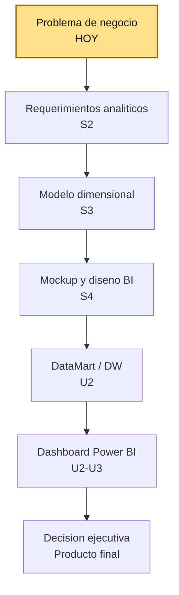
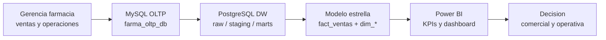

# S1 - Fundamentos BI y problema de negocio

## 1. Introduccion

Tiempo: 20 min.

### 1.1 Proposito

Comprender el ciclo BI y delimitar el problema de negocio que guiara la solucion analitica del curso.

### 1.2 Resultado de aprendizaje

El estudiante explica el ciclo BI negocio -> datos -> insight -> decision y lo aplica al caso `farmabi`, identificando decisiones ejecutivas, actores, preguntas analiticas, fuentes de datos y primeras evidencias disponibles en el repositorio.

### 1.3 Producto de sesion

Caso de negocio BI delimitado para `farmabi`, con decisiones esperadas, actores, preguntas analiticas iniciales, fuentes de datos y primer mapa del flujo de datos.

### 1.4 Motivacion de la sesion

#### 1.4.1 Caso: farmacia con ventas, pedidos y despacho

Una cadena de farmacia registra clientes, vendedores, productos, categorias, familias, pedidos y detalles de pedido en una base transaccional. La gerencia necesita responder preguntas como:

- Cuanto vendemos realmente despues de descuentos?
- Que productos, familias o categorias aportan mas margen?
- Que vendedores o clientes concentran ventas?
- Que pedidos tardan mas en confirmarse, despacharse o entregarse?
- Como evolucionan ventas, margen y descuentos en el tiempo?

El problema no es solo tener datos. El reto BI es convertir esos datos operacionales en informacion confiable para tomar decisiones.

Pregunta guia:

```text
Que decision de negocio queremos mejorar y que datos necesitamos para sostenerla?
```

### 1.5 Ubicacion en el curso

- Unidad: U1 - Definicion del sistema de informacion para ejecutivos.
- Producto de unidad: diseno funcional y analitico de la solucion BI.
- Avance del producto en esta sesion: problema de negocio, actores, decisiones y preguntas analiticas iniciales.

Roadmap del producto BI:



## 2. Explica

Tiempo: 15 min.

### 2.1 Conceptos clave

Business Intelligence no empieza en Power BI. Empieza con una decision de negocio.

| Concepto | Sentido en el curso |
|---|---|
| Problema de negocio | Situacion que requiere una decision mejor informada |
| Pregunta analitica | Pregunta que puede responderse con datos |
| KPI | Medida que resume desempeno y permite seguimiento |
| Fuente operacional | Sistema donde nacen los datos del negocio |
| Insight | Lectura accionable que conecta dato y decision |
| Consumo ejecutivo | Forma en que el usuario final explora KPIs y hallazgos |

### 2.2 Ciclo BI del curso

```text
negocio -> datos -> modelo -> insight -> decision
```

En `farmabi`, ese ciclo se implementa asi:



### 2.3 Activos reales del repositorio

El curso no trabaja con un caso abstracto. El repositorio ya contiene los componentes que se usaran en U2:

| Carpeta o archivo | Rol en el caso BI |
|---|---|
| `oltp-mysql/` | Base transaccional MySQL `farma_oltp_db` |
| `dw-pg/` | PostgreSQL analitico `farmabi_dw` |
| `ingesta-debezium/` | Ingesta CDC con Debezium + Kafka |
| `ingesta-airbyte/` | Variante batch/configurada de ingesta |
| `dw-dbt/` | Transformacion hacia `staging` y `marts` |
| `powerbi/` | Medidas DAX, PBIX y reportes |

Tablas operacionales principales:

| Tabla OLTP | Uso analitico probable |
|---|---|
| `clientes` | Analisis por cliente |
| `vendedores` | Analisis comercial por vendedor |
| `familias`, `categorias`, `productos` | Analisis de producto |
| `pedidos` | Estado, fechas y ciclo operativo |
| `pedido_detalles` | Cantidades, precios, descuentos, costos y venta |

### 2.4 Errores frecuentes al iniciar BI

| Problema | Riesgo | Correccion |
|---|---|---|
| Empezar por graficos | Dashboard bonito sin decision clara | Definir decision y pregunta |
| Confundir dato con KPI | Medidas sin accion | Relacionar KPI con objetivo |
| Pedir todos los datos | Alcance inmanejable | Priorizar proceso de negocio |
| No definir usuario | Visualizaciones genericas | Identificar actor ejecutivo |
| No mapear fuentes | No hay trazabilidad | Vincular pregunta con tabla/campo |

## 3. Aplica: actividad practica guiada

Tiempo: 3h.

El docente guia la lectura del caso `farmabi` y los estudiantes construyen el primer documento de definicion BI.

### 3.1 Reconocer el flujo del laboratorio

**Producto del paso:** mapa simple del flujo de datos del curso.

Lee la arquitectura del repositorio y registra el flujo base:

```text
MySQL OLTP -> Debezium/Kafka o Airbyte -> PostgreSQL RAW -> dbt -> marts -> Power BI
```

Responde:

1. Donde nacen los datos?
2. Donde aterrizan los datos crudos?
3. Donde se transforma el modelo analitico?
4. Que consume Power BI?

### 3.2 Identificar decisiones de negocio

**Producto del paso:** lista priorizada de decisiones ejecutivas.

Proponga al menos cinco decisiones posibles. Ejemplos:

| Decision | Actor | Frecuencia |
|---|---|---|
| Priorizar categorias con mayor margen | Gerencia comercial | Semanal |
| Evaluar cumplimiento de ventas | Jefatura comercial | Mensual |
| Detectar pedidos con lead time alto | Operaciones | Diario |
| Revisar descuentos excesivos | Finanzas / comercial | Semanal |
| Identificar clientes de mayor valor | Gerencia | Mensual |

Selecciona una decision principal para el proyecto del equipo.

### 3.3 Formular preguntas analiticas

**Producto del paso:** banco inicial de preguntas BI.

Cada pregunta debe poder responderse con datos del caso.

Ejemplos:

1. Cual es la venta neta mensual y su variacion contra el periodo anterior?
2. Que familias de producto generan mayor margen bruto?
3. Que vendedores concentran mayor venta neta?
4. Que porcentaje de pedidos se entrega dentro de 24 horas?
5. Cual es el ticket promedio por cliente o categoria?

### 3.4 Mapear preguntas a fuentes

**Producto del paso:** matriz pregunta-fuente.

| Pregunta | Tablas fuente | Campos candidatos |
|---|---|---|
| Venta neta mensual | `pedidos`, `pedido_detalles` | `fecha_creacion`, `cantidad`, `precio_venta_unitario`, `total_descuento_unitario` |
| Margen por familia | `pedido_detalles`, `productos`, `familias` | `precio_venta_unitario`, `precio_compra_unitario`, `familia_id` |
| Lead time de entrega | `pedidos` | `fecha_creacion`, `fecha_entrega` |
| Descuento aplicado | `pedido_detalles` | `total_descuento_unitario`, `precio_venta_unitario` |

### 3.5 Definir el alcance inicial

**Producto del paso:** alcance BI de S1.

Completa:

```text
Proceso de negocio principal:
Decision que se desea mejorar:
Usuario ejecutivo principal:
Preguntas analiticas priorizadas:
Fuentes disponibles:
Fuentes no disponibles o supuestos:
Riesgos de calidad de datos:
```

## 4. Crea: actividad autonoma

Tiempo: 4h fuera del aula.

### 4.1 Plantilla de evidencia individual

Entrega un PDF con el siguiente nombre:

```text
S01_Equipo##_ApellidoNombre.pdf
```

El PDF debe incluir:

1. Datos del estudiante, equipo y repositorio.
2. Decision de negocio priorizada.
3. Actor ejecutivo principal.
4. Minimo cinco preguntas analiticas.
5. Matriz pregunta-fuente.
6. Diagrama simple del ciclo BI del equipo.
7. Un riesgo de calidad o trazabilidad.
8. Reflexion breve:

```text
Por que una solucion BI debe empezar por una decision y no por un grafico?
```

### 4.2 Criterios minimos de aceptacion

- El caso de negocio esta delimitado.
- Las preguntas analiticas son medibles.
- Las fuentes pertenecen al repositorio `farmabi`.
- El documento conecta negocio, datos y decision.
- La evidencia identifica un aporte individual verificable.

## 5. Cierre evaluativo

Tiempo: 20 min.

### 5.1 Resultados esperados

Al finalizar la sesion, el estudiante debe demostrar que:

- Explica el ciclo BI.
- Identifica el problema de negocio del caso farmacia.
- Distingue fuente operacional, DW, DataMart y dashboard.
- Formula preguntas analiticas verificables.
- Mapea preguntas hacia tablas fuente.

### 5.2 Preguntas de defensa

1. Que decision de negocio guia tu solucion BI?
2. Que usuario consumira el dashboard?
3. Que pregunta analitica consideras mas importante?
4. Que tabla fuente respalda esa pregunta?
5. Que riesgo aparece si no se define el problema antes del dashboard?

### 5.3 Rubrica de evaluacion

| Dimension | Peso | 3 - Logro destacado | 2 - Logro | 1 - Proceso | 0 - Inicio | Puntuacion obtenida |
|---|---:|---|---|---|---|---:|
| 1. Problema y decision | 2 | Delimita problema, actor y decision con claridad ejecutiva. | Define problema y decision comprensibles. | Presenta una idea general sin actor claro. | No delimita el problema. | |
| 2. Preguntas analiticas | 2 | Formula preguntas medibles, priorizadas y conectadas al negocio. | Formula preguntas medibles. | Preguntas vagas o poco medibles. | No formula preguntas utiles. | |
| 3. Mapeo a fuentes | 2 | Relaciona preguntas con tablas y campos reales del repo. | Relaciona preguntas con tablas reales. | Mapeo incompleto o generico. | No usa fuentes reales. | |
| 4. Comprension del ciclo BI | 2 | Explica negocio -> datos -> insight -> decision aplicado a `farmabi`. | Explica el ciclo BI de forma correcta. | Explicacion parcial. | No explica el ciclo. | |
| 5. Aporte individual | 1 | Aporte verificable y bien documentado. | Aporte identificable. | Aporte mencionado de forma general. | Sin aporte individual. | |
| 6. Orden y reflexion | 1 | Evidencia clara, ordenada y reflexion tecnica precisa. | Evidencia comprensible. | Evidencia desordenada o superficial. | Sin evidencia suficiente. | |

Puntuacion acumulada = suma de (`Peso` * `Puntuacion obtenida`) = ____.

Nota final = (`Puntuacion acumulada` / 30) * 20 = ____.
