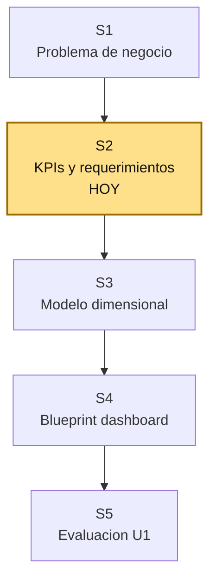

# S2 - Requerimientos analiticos y KPIs

## 1. Introduccion

Tiempo: 20 min.

### 1.1 Proposito

Convertir el problema de negocio definido en S1 en requerimientos analiticos y KPIs verificables para la solucion BI.

### 1.2 Resultado de aprendizaje

El estudiante define KPIs de ventas, margen, descuentos y operacion usando formulas, dimensiones de analisis, fuentes de datos, criterios de aceptacion y reglas basicas de validacion.

### 1.3 Producto de sesion

Matriz de requerimientos analiticos con KPIs priorizados, formulas, granularidad, dimensiones, fuentes, responsables y criterios de aceptacion.

### 1.4 Motivacion de la sesion

#### 1.4.1 Caso: de preguntas a indicadores

En S1 se formularon preguntas como:

```text
Cuanto vendemos?
Que productos dejan mas margen?
Que pedidos se entregan tarde?
```

En S2 esas preguntas deben transformarse en indicadores gobernables. Un KPI no es solo un numero en una tarjeta; debe tener formula, fuente, frecuencia, responsable y uso esperado.

Pregunta guia:

```text
Como sabemos que un KPI esta bien definido y que todos lo calculan igual?
```

### 1.5 Ubicacion en el curso

- Unidad: U1 - Definicion del sistema de informacion para ejecutivos.
- Producto de unidad: diseno funcional y analitico de la solucion BI.
- Avance del producto en esta sesion: matriz de requerimientos analiticos y KPIs.

Roadmap de U1:



## 2. Explica

Tiempo: 15 min.

### 2.1 De pregunta analitica a KPI

| Pregunta | KPI candidato | Formula base |
|---|---|---|
| Cuanto vendemos? | Ventas Netas | venta bruta - descuentos |
| Cuanto margen dejamos? | Margen Bruto | venta neta - costo total |
| Que tan rentable es la venta? | % Margen Bruto | margen bruto / venta neta |
| Cuantos pedidos atendemos? | Pedidos | conteo distinto de `pedido_id` |
| Cuanto compra en promedio un pedido? | Ticket Promedio | ventas netas / pedidos |
| Cumplimos entregas? | % Pedidos a Tiempo | pedidos con lead time <= 24h / pedidos |

### 2.2 KPIs base disponibles en `farmabi`

El archivo `powerbi/medidas_farmacia_bi.dax` ya propone medidas que serviran de referencia en U2:

| KPI | Medida DAX de referencia |
|---|---|
| Ventas Brutas | `Ventas Brutas = SUM(fact_ventas[venta_bruta])` |
| Descuentos | `Descuentos = SUM(fact_ventas[descuento_total])` |
| Ventas Netas | `Ventas Netas = SUM(fact_ventas[venta_neta])` |
| Costo Total | `Costo Total = SUM(fact_ventas[costo_total])` |
| Margen Bruto | `Margen Bruto = SUM(fact_ventas[margen_bruto])` |
| Unidades Vendidas | `Unidades Vendidas = SUM(fact_ventas[cantidad_vendida])` |
| Pedidos | `Pedidos = DISTINCTCOUNT(fact_ventas[pedido_id])` |
| Ticket Promedio | `Ticket Promedio = DIVIDE([Ventas Netas], [Pedidos])` |
| % Pedidos a Tiempo | pedidos con `horas_lead_time <= 24` / pedidos |

En S2 no se construye todavia el dashboard. Se define que significan esos KPIs y como se aceptara su calculo.

### 2.3 Dimensiones de analisis

Las dimensiones candidatas del modelo final son:

| Dimension | Uso analitico |
|---|---|
| `dim_fecha` | Analisis por dia, mes, trimestre y anio |
| `dim_producto` | Producto, categoria y familia |
| `dim_cliente` | Cliente |
| `dim_vendedor` | Vendedor |
| `dim_estado_pedido` | Estado del pedido |

Estas dimensiones se construiran fisicamente en U2, pero se definen conceptualmente desde U1.

### 2.4 Criterios de un buen KPI

Un KPI aceptable debe responder:

1. Que mide?
2. Para que decision sirve?
3. Como se calcula?
4. Desde que fuente se obtiene?
5. Con que dimensiones se analiza?
6. Cual es su frecuencia de actualizacion?
7. Como se valida?
8. Quien es responsable de interpretarlo?

## 3. Aplica: actividad practica guiada

Tiempo: 3h.

El docente guia la construccion de la matriz de requerimientos analiticos del caso `farmabi`.

### 3.1 Priorizar requerimientos

**Producto del paso:** lista priorizada de requerimientos.

Ejemplo:

| ID | Requerimiento analitico | Actor | Prioridad |
|---|---|---|---|
| RA-01 | Monitorear ventas netas por periodo | Gerencia comercial | Alta |
| RA-02 | Analizar margen por familia y categoria | Gerencia comercial | Alta |
| RA-03 | Controlar descuentos aplicados | Finanzas | Media |
| RA-04 | Medir tiempo de confirmacion y entrega | Operaciones | Alta |
| RA-05 | Comparar ventas contra periodo anterior | Gerencia | Media |

### 3.2 Definir ficha de KPI

**Producto del paso:** ficha por KPI.

Usa esta plantilla:

| Campo | Valor |
|---|---|
| Codigo KPI |  |
| Nombre |  |
| Decision que soporta |  |
| Pregunta analitica |  |
| Formula de negocio |  |
| Formula tecnica candidata |  |
| Fuente OLTP |  |
| Campo DataMart esperado |  |
| Dimensiones de analisis |  |
| Frecuencia |  |
| Criterio de aceptacion |  |
| Responsable |  |

### 3.3 Completar KPIs base del curso

**Producto del paso:** minimo seis KPIs definidos.

KPIs sugeridos:

| Codigo | KPI | Formula de negocio |
|---|---|---|
| KPI-01 | Ventas Netas | sum(cantidad * precio venta) - sum(cantidad * descuento) |
| KPI-02 | Margen Bruto | ventas netas - costo total |
| KPI-03 | % Margen Bruto | margen bruto / ventas netas |
| KPI-04 | Descuentos | sum(cantidad * descuento unitario) |
| KPI-05 | Ticket Promedio | ventas netas / pedidos |
| KPI-06 | % Pedidos a Tiempo | pedidos con lead time <= 24h / pedidos |

### 3.4 Mapear fuentes y campos

**Producto del paso:** trazabilidad inicial KPI-fuente-modelo.

Ejemplo:

| KPI | Fuente OLTP | Campo DataMart esperado | Medida BI esperada |
|---|---|---|---|
| Ventas Netas | `pedido_detalles` | `fact_ventas.venta_neta` | `Ventas Netas` |
| Margen Bruto | `pedido_detalles` | `fact_ventas.margen_bruto` | `Margen Bruto` |
| % Margen Bruto | `pedido_detalles` | `fact_ventas.pct_margen_bruto` | `% Margen Bruto` |
| Pedidos | `pedidos` | `fact_ventas.pedido_id` | `Pedidos` |
| Lead time | `pedidos` | `fact_ventas.horas_lead_time` | `% Pedidos a Tiempo` |

### 3.5 Definir criterios de aceptacion

**Producto del paso:** reglas minimas de validacion.

Ejemplos:

| KPI | Criterio de aceptacion |
|---|---|
| Ventas Netas | Debe coincidir con consulta SQL de control sobre detalle de pedidos |
| Pedidos | Debe contar pedidos distintos, no lineas de detalle |
| % Margen Bruto | Debe devolver blanco o nulo si ventas netas es cero |
| % Pedidos a Tiempo | Solo considera pedidos con `horas_lead_time` no nulo |
| Ticket Promedio | Debe usar division segura |

### 3.6 Preparar la matriz final

**Producto del paso:** matriz de requerimientos para usar en S3.

Columnas minimas:

```text
ID, pregunta analitica, KPI, formula, fuente, grano esperado,
dimensiones, filtro principal, criterio de aceptacion, prioridad
```

## 4. Crea: actividad autonoma

Tiempo: 4h fuera del aula.

### 4.1 Plantilla de evidencia individual

Entrega un PDF con el siguiente nombre:

```text
S02_Equipo##_ApellidoNombre.pdf
```

El PDF debe incluir:

1. Datos del estudiante, equipo y repositorio.
2. Matriz con minimo seis requerimientos analiticos.
3. Ficha completa de minimo cuatro KPIs.
4. Trazabilidad KPI -> fuente OLTP -> campo DataMart esperado.
5. Criterios de aceptacion por KPI.
6. Reflexion breve:

```text
Que problema aparece si dos areas calculan el mismo KPI con formulas distintas?
```

### 4.2 Criterios minimos de aceptacion

- Los KPIs tienen formula clara.
- Cada KPI soporta una decision.
- Cada KPI tiene fuente de datos real del caso.
- La matriz incluye dimensiones de analisis.
- Los criterios de aceptacion permiten validar el resultado en U2.

## 5. Cierre evaluativo

Tiempo: 20 min.

### 5.1 Resultados esperados

Al finalizar la sesion, el estudiante debe demostrar que:

- Diferencia pregunta analitica, requerimiento y KPI.
- Define formulas de negocio para KPIs base.
- Relaciona KPIs con fuentes y campos esperados.
- Define dimensiones de analisis.
- Propone criterios de aceptacion verificables.

### 5.2 Preguntas de defensa

1. Que KPI es mas importante para tu decision priorizada?
2. Como se calcula venta neta?
3. Por que `Pedidos` debe ser conteo distinto?
4. Que dimension permite analizar producto por categoria y familia?
5. Como validarias un KPI contra SQL?
6. Que KPI puede generar conflicto si no se define bien?

### 5.3 Rubrica de evaluacion

| Dimension | Peso | 3 - Logro destacado | 2 - Logro | 1 - Proceso | 0 - Inicio | Puntuacion obtenida |
|---|---:|---|---|---|---|---:|
| 1. Requerimientos analiticos | 2 | Requerimientos claros, priorizados y conectados a decisiones. | Requerimientos claros. | Requerimientos incompletos o genericos. | No presenta requerimientos. | |
| 2. Definicion de KPIs | 2 | KPIs con formula, objetivo, responsable y frecuencia. | KPIs con formula y objetivo. | KPIs con definicion parcial. | No define KPIs utiles. | |
| 3. Trazabilidad | 2 | Mapea KPI -> fuente -> campo DataMart -> medida BI. | Mapea KPI hacia fuentes reales. | Trazabilidad parcial. | No hay trazabilidad. | |
| 4. Criterios de aceptacion | 2 | Criterios verificables y orientados a validacion SQL/BI. | Criterios comprensibles. | Criterios vagos. | No define criterios. | |
| 5. Aporte individual | 1 | Aporte verificable y bien documentado. | Aporte identificable. | Aporte mencionado de forma general. | Sin aporte individual. | |
| 6. Orden y reflexion | 1 | Evidencia clara, ordenada y reflexion tecnica precisa. | Evidencia comprensible. | Evidencia desordenada o superficial. | Sin evidencia suficiente. | |

Puntuacion acumulada = suma de (`Peso` * `Puntuacion obtenida`) = ____.

Nota final = (`Puntuacion acumulada` / 30) * 20 = ____.
