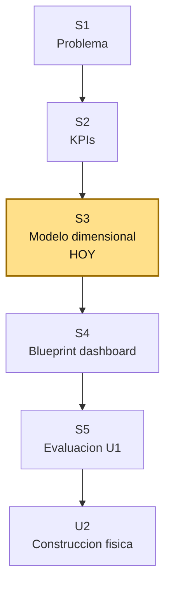
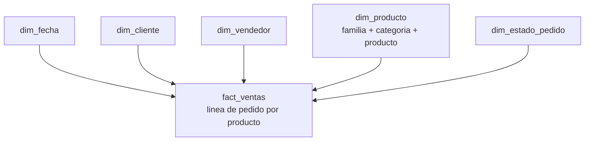

# S3 - Modelado dimensional y metadata

## 1. Introduccion

Tiempo: 20 min.

### 1.1 Proposito

Diseñar el modelo dimensional conceptual del caso `farmabi`, definiendo hecho, grano, dimensiones, jerarquias, metadata y trazabilidad desde el OLTP.

### 1.2 Resultado de aprendizaje

El estudiante convierte requerimientos analiticos y KPIs en un modelo estrella verificable, identificando la tabla de hechos, su granularidad, dimensiones, jerarquias y mapeo fuente-modelo.

### 1.3 Producto de sesion

Modelo dimensional de ventas y ciclo de pedidos con `fact_ventas`, dimensiones oficiales, grano congelado, jerarquias y matriz de trazabilidad OLTP -> DataMart.

### 1.4 Motivacion de la sesion

En S1 y S2 se definieron problema, preguntas y KPIs. Ahora se responde:

```text
Que estructura analitica necesitamos para responder esas preguntas de forma consistente?
```

El modelo dimensional evita que cada usuario calcule ventas, margen o lead time de forma distinta. El diseño se hace antes de construir tablas fisicas.

### 1.5 Ubicacion en el curso

- Unidad: U1 - Definicion del sistema de informacion para ejecutivos.
- Producto de unidad: diseño funcional y analitico de la solucion BI.
- Avance del producto en esta sesion: modelo estrella y metadata.

Roadmap:



## 2. Explica

Tiempo: 15 min.

### 2.1 Conceptos clave

| Concepto | Uso en `farmabi` |
|---|---|
| Proceso de negocio | Pedidos / ventas |
| Hecho | `fact_ventas` |
| Grano | Una fila por linea de pedido por producto |
| Dimension | Eje para analizar el hecho |
| Jerarquia | Ruta de exploracion dentro de una dimension |
| Metadata | Definicion de campos, origen, formula y reglas |
| Trazabilidad | Relacion fuente -> modelo -> KPI |

### 2.2 Hecho y grano oficial

Hecho principal:

```text
fact_ventas
```

Grano congelado:

```text
una fila por linea de pedido por producto
```

Esto significa que el hecho conserva el detalle de `pedido_detalles`, complementado con datos de cabecera de `pedidos`.

No se modela una fila resumida por dia, cliente, vendedor y producto. Ese resumen se obtiene despues mediante agregaciones en SQL, dbt o Power BI.

### 2.3 Dimensiones oficiales

| Dimension | Origen | Rol |
|---|---|---|
| `dim_fecha` | `pedidos.fecha_creacion` | Analisis temporal |
| `dim_cliente` | `clientes` | Analisis por comprador |
| `dim_vendedor` | `vendedores` | Analisis comercial |
| `dim_producto` | `productos + categorias + familias` | Producto y clasificacion comercial |
| `dim_estado_pedido` | `pedidos.estado_pedido` | Estado del proceso |

Decision de diseño:

```text
No se crean dim_categoria ni dim_familia.
Categoria y familia se denormalizan dentro de dim_producto.
```

### 2.4 Jerarquias

| Jerarquia | Niveles |
|---|---|
| Tiempo | Dia -> Mes -> Trimestre -> Anio |
| Producto comercial | Familia -> Categoria -> Producto |

Estas jerarquias se usaran luego en Power BI para drill-down y navegacion analitica.

### 2.5 Esquema estrella conceptual



## 3. Aplica: actividad practica guiada

Tiempo: 3h.

### 3.1 Confirmar proceso de negocio

**Producto del paso:** proceso analitico oficial.

Completa:

```text
Proceso: Pedidos / Ventas
Hecho: fact_ventas
Grano: una fila por linea de pedido por producto
Fuente base: pedido_detalles
Fuente complementaria: pedidos
```

### 3.2 Definir medidas del hecho

**Producto del paso:** lista de medidas de `fact_ventas`.

Medidas oficiales:

| Medida | Definicion |
|---|---|
| `cantidad_vendida` | Unidades vendidas |
| `venta_bruta` | Cantidad * precio venta unitario |
| `descuento_total` | Cantidad * descuento unitario |
| `venta_neta` | Venta bruta - descuento total |
| `costo_total` | Cantidad * precio compra unitario |
| `margen_bruto` | Venta neta - costo total |
| `pct_margen_bruto` | Margen bruto / venta neta |
| `minutos_confirmacion` | Creacion -> confirmacion |
| `minutos_despacho` | Confirmacion -> envio |
| `horas_entrega` | Envio -> entrega |
| `horas_lead_time` | Creacion -> entrega |
| `pedido_count` | Auxiliar para conteo |

### 3.3 Construir matriz fuente-modelo

**Producto del paso:** trazabilidad OLTP -> DataMart.

| Elemento modelo | Fuente OLTP | Regla |
|---|---|---|
| `fact_ventas` | `pedido_detalles + pedidos` | Integrar detalle con cabecera |
| `dim_cliente` | `clientes` | Una fila por cliente |
| `dim_vendedor` | `vendedores` | Una fila por vendedor |
| `dim_producto` | `productos + categorias + familias` | Producto denormalizado con clasificacion |
| `dim_fecha` | `pedidos.fecha_creacion` | Fecha analitica principal |
| `dim_estado_pedido` | `pedidos.estado_pedido` | Estados distintos del pedido |

### 3.4 Definir metadata minima

**Producto del paso:** diccionario de datos inicial.

Ejemplo:

| Campo | Tabla | Tipo conceptual | Formula u origen | Uso |
|---|---|---|---|---|
| `venta_neta` | `fact_ventas` | Medida monetaria | venta bruta - descuento | KPI ventas |
| `familia_nombre` | `dim_producto` | Atributo | `familias.nombre` | Jerarquia producto |
| `fecha_key` | `dim_fecha` | Clave | `yyyymmdd` | Relacion temporal |
| `horas_lead_time` | `fact_ventas` | Medida operativa | creacion -> entrega | KPI operativo |

### 3.5 Validar el modelo contra preguntas

**Producto del paso:** matriz pregunta-modelo.

| Pregunta | Hecho | Dimensiones | Medidas |
|---|---|---|---|
| Cuanto se vende por mes? | `fact_ventas` | `dim_fecha` | `venta_neta` |
| Que familia genera mayor margen? | `fact_ventas` | `dim_producto` | `margen_bruto` |
| Que vendedor vende mas? | `fact_ventas` | `dim_vendedor` | `venta_neta` |
| Que pedidos demoran mas? | `fact_ventas` | `dim_estado_pedido`, `dim_fecha` | `horas_lead_time` |

## 4. Crea: actividad autonoma

Tiempo: 4h fuera del aula.

Entrega un PDF:

```text
S03_Equipo##_ApellidoNombre.pdf
```

Debe incluir:

1. Esquema estrella conceptual.
2. Grano del hecho con ejemplo.
3. Lista de dimensiones y atributos principales.
4. Lista de medidas oficiales.
5. Matriz fuente-modelo.
6. Diccionario de datos minimo.
7. Validacion de al menos cinco preguntas analiticas contra el modelo.
8. Reflexion breve:

```text
Que error ocurre si no se define correctamente el grano del hecho?
```

## 5. Cierre evaluativo

Tiempo: 20 min.

### 5.1 Resultados esperados

El estudiante debe demostrar que:

- Define el hecho y su grano.
- Identifica dimensiones y jerarquias.
- Explica por que `dim_producto` es denormalizada.
- Mapea fuentes OLTP hacia el modelo dimensional.
- Valida que el modelo responde preguntas analiticas.

### 5.2 Preguntas de defensa

1. Cual es el grano de `fact_ventas`?
2. Por que no se agregan filas por fecha y producto?
3. Por que categoria y familia viven en `dim_producto`?
4. Que tablas fuente alimentan el hecho?
5. Que KPI usa las fechas de `pedidos`?

### 5.3 Rubrica

| Dimension | Peso | 3 - Logro destacado | 2 - Logro | 1 - Proceso | 0 - Inicio | Puntuacion obtenida |
|---|---:|---|---|---|---|---:|
| Hecho y grano | 2 | Define y justifica el grano con ejemplo claro. | Define hecho y grano. | Definicion parcial. | No define grano. | |
| Dimensiones y jerarquias | 2 | Identifica dimensiones, atributos y jerarquias correctamente. | Identifica dimensiones principales. | Omite dimensiones o jerarquias. | No presenta modelo. | |
| Trazabilidad fuente-modelo | 2 | Mapea fuentes, reglas y campos con precision. | Mapea fuentes principales. | Mapeo incompleto. | Sin trazabilidad. | |
| Metadata | 2 | Diccionario util para construir U2. | Diccionario basico. | Metadata superficial. | Sin metadata. | |
| Defensa conceptual | 1 | Explica decisiones de diseño con claridad. | Explica decisiones principales. | Explicacion debil. | No defiende. | |
| Orden y evidencia | 1 | Documento claro y verificable. | Documento comprensible. | Documento desordenado. | Sin evidencia. | |

Puntuacion acumulada = suma de (`Peso` * `Puntuacion obtenida`) = ____.

Nota final = (`Puntuacion acumulada` / 30) * 20 = ____.
