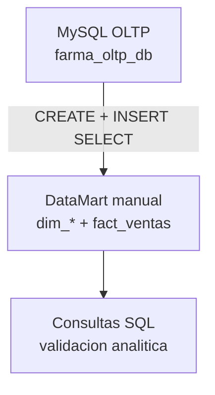

# S6 - Implementacion manual del DW con SQL

## 1. Introduccion

Tiempo: 20 min.

### 1.1 Proposito

Construir manualmente el DataMart de ventas dentro del entorno MySQL para comprender, con SQL puro, como se pasa desde un OLTP hacia una estructura analitica.

### 1.2 Resultado de aprendizaje

El estudiante implementa fisicamente dimensiones y tabla de hechos, carga datos con SQL, valida totales analiticos y reconoce las limitaciones del enfoque manual antes de pasar a herramientas.

### 1.3 Producto de sesion

DataMart manual con `dim_cliente`, `dim_vendedor`, `dim_producto`, `dim_fecha`, `dim_estado_pedido` y `fact_ventas`, cargado y validado con consultas SQL.

### 1.4 Ubicacion en el curso

- Unidad: U2 - Construccion del BI.
- Producto U2: solucion BI implementada con DataMart, pipeline, modelo semantico y visualizacion.
- Avance de sesion: DataMart manual y validacion SQL.

## 2. Explica

### 2.1 Arquitectura de la sesion



### 2.2 Alcance manual

En esta sesion no se usa Airbyte, Debezium ni dbt. El objetivo es entender:

- la estructura fisica de dimensiones y hechos;
- el grano de `fact_ventas`;
- la carga de dimensiones con `INSERT INTO ... SELECT`;
- la carga del hecho integrando `pedidos` y `pedido_detalles`;
- la validacion de KPIs contra el OLTP.

### 2.3 Modelo fisico esperado

| Tabla | Tipo | Fuente principal |
|---|---|---|
| `dim_cliente` | Dimension | `clientes` |
| `dim_vendedor` | Dimension | `vendedores` |
| `dim_producto` | Dimension | `productos + categorias + familias` |
| `dim_fecha` | Dimension | `pedidos.fecha_creacion` |
| `dim_estado_pedido` | Dimension | `pedidos.estado_pedido` |
| `fact_ventas` | Hecho | `pedido_detalles + pedidos` |

## 3. Aplica: actividad practica guiada

Tiempo: 3h.

### 3.0 Material legacy de referencia

Estas practicas antiguas quedan archivadas fuera del menu principal y sirven para recuperar pasos detallados:

| Practica legacy | Uso recomendado |
|---|---|
| [U2 S1 P1 - Implementacion fisica manual](_u2_legacy/SESION_U2_S1_P1_IMPLEMENTACION_FISICA_MANUAL_DEL_DATAMART_DENTRO_DEL_MISMO_OLTP.md) | Crear dimensiones y tabla de hechos en MySQL |
| [U2 S1 P2 - ETL manual con SQL](_u2_legacy/SESION_U2_S1_P2_ETL_MANUAL_CON_SQL_PARA_DIMENSIONES_Y_HECHO_MEDIANTE_LA_VISTA_G.md) | Cargar dimensiones y hecho con SQL |
| [U2 S1 P3 - Validacion analitica manual](_u2_legacy/SESION_U2_S1_P3_VALIDACION_ANALITICA_DEL_DATAMART_MANUAL.md) | Validar totales y consistencia del DataMart manual |

### 3.1 Preparar MySQL OLTP

**Producto del paso:** fuente transaccional operativa.

```powershell
cd oltp-mysql
docker compose up -d
docker compose ps
docker exec -it farmabi-oltp-mysql mysql -uroot -proot farma_oltp_db
```

Validaciones:

```sql
SHOW TABLES;
DESCRIBE pedidos;
DESCRIBE pedido_detalles;
```

### 3.2 Crear estructura manual del DataMart

**Producto del paso:** tablas `dim_*` y `fact_ventas` creadas.

Usa como referencia el script:

```text
oltp-mysql/1_dm.sql
```

Tablas esperadas:

```sql
SHOW TABLES LIKE 'dim_%';
SHOW TABLES LIKE 'fact_%';
DESCRIBE fact_ventas;
```

### 3.3 Cargar dimensiones

**Producto del paso:** dimensiones pobladas con claves y atributos.

Reglas:

| Dimension | Regla de carga |
|---|---|
| `dim_cliente` | clientes distintos |
| `dim_vendedor` | vendedores distintos |
| `dim_producto` | producto con categoria y familia denormalizadas |
| `dim_fecha` | fechas distintas de `pedidos.fecha_creacion` |
| `dim_estado_pedido` | estados distintos de pedido |

### 3.4 Cargar `fact_ventas`

**Producto del paso:** tabla de hechos cargada al grano oficial.

Grano:

```text
una fila por linea de pedido por producto
```

Medidas minimas:

```text
cantidad_vendida, venta_bruta, descuento_total, venta_neta,
costo_total, margen_bruto, pct_margen_bruto,
minutos_confirmacion, minutos_despacho,
horas_entrega, horas_lead_time, pedido_count
```

### 3.5 Validar resultados

**Producto del paso:** evidencia de conciliacion.

Consultas base:

```sql
SELECT SUM(cantidad_vendida) FROM fact_ventas;
SELECT SUM(venta_bruta), SUM(descuento_total), SUM(venta_neta) FROM fact_ventas;
SELECT COUNT(*) FROM fact_ventas;
SELECT COUNT(DISTINCT pedido_id) FROM fact_ventas;
```

Comparar con consultas contra `pedido_detalles` y `pedidos`.

## 4. Crea: actividad autonoma

Entrega:

```text
S06_Equipo##_ApellidoNombre.pdf
```

Debe incluir:

1. Evidencia de MySQL operativo.
2. Script o captura de creacion de dimensiones y hecho.
3. Evidencia de carga de dimensiones.
4. Evidencia de carga de `fact_ventas`.
5. Comparacion OLTP vs DataMart.
6. Explicacion del grano y una limitacion del enfoque manual.

## 5. Cierre evaluativo

### 5.1 Preguntas de defensa

1. Cual es el grano de `fact_ventas`?
2. Por que `dim_producto` contiene categoria y familia?
3. Que medidas vienen de `pedido_detalles`?
4. Que medidas vienen de fechas de `pedidos`?
5. Por que este enfoque manual no es suficiente como pipeline final?

### 5.2 Rubrica

| Dimension | Peso | 3 | 2 | 1 | 0 | Puntaje |
|---|---:|---|---|---|---|---:|
| Estructura fisica | 2 | Modelo completo y coherente | Modelo con detalles menores | Modelo incompleto | No crea modelo | |
| Carga SQL | 2 | Dimensiones y hecho cargados correctamente | Carga con errores menores | Carga parcial | Sin carga | |
| Validacion | 2 | Concilia OLTP vs DataMart | Valida totales principales | Valida superficialmente | No valida | |
| Comprension del grano | 2 | Lo explica y defiende | Lo define | Lo confunde parcialmente | No lo define | |
| Evidencia individual | 1 | Clara y verificable | Identificable | General | Ausente | |
| Orden | 1 | Documento claro | Comprensible | Desordenado | Insuficiente | |
