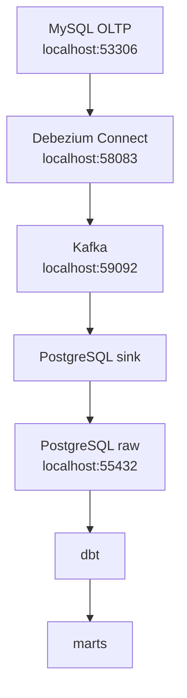

# S7 - Pipeline BI con herramientas

## 1. Introduccion

### 1.1 Proposito

Implementar el pipeline BI separando la fuente transaccional del repositorio analitico y usando herramientas para ingesta, transformacion y carga analitica.

### 1.2 Resultado de aprendizaje

El estudiante replica datos desde MySQL hacia PostgreSQL `raw`, transforma con dbt hacia `staging` y `marts`, valida el pipeline y distingue carga batch, CDC, incrementalidad y SCD.

### 1.3 Producto de sesion

Pipeline operativo:

```text
MySQL OLTP -> Debezium/Kafka o Airbyte -> PostgreSQL raw -> dbt staging -> dbt marts
```

## 2. Explica

### 2.1 Arquitectura principal con CDC



### 2.2 Variante con Airbyte

Airbyte puede reemplazar la parte de ingesta:

```text
MySQL OLTP -> Airbyte -> PostgreSQL raw -> dbt -> marts
```

No se usan Airbyte y Debezium al mismo tiempo para la misma carga del laboratorio. Se elige una ruta y se documenta.

### 2.3 Capas del pipeline

| Capa | Equivalencia | Proposito |
|---|---|---|
| `raw` | Bronze | Datos replicados desde OLTP |
| `staging` | Silver | Limpieza, renombrado y estandarizacion |
| `marts` | Gold | Dimensiones y hechos para BI |

## 3. Aplica: actividad practica guiada

### 3.0 Material legacy de referencia

Estas practicas antiguas quedan archivadas fuera del menu principal y sirven para recuperar pasos detallados:

| Practica legacy | Uso recomendado |
|---|---|
| [U2 S2 P1 - Airbyte replica MySQL PostgreSQL](_u2_legacy/SESION_U2_S2_P1_AIRBYTE_REPLICA_MYSQL_POSTGRES.md) | Variante batch/configurada de ingesta hacia `raw` |
| [U2 S2 P2 - dbt modelado fisico DataMart](_u2_legacy/SESION_U2_S2_P2_DBT_MODELADO_FISICO_DATAMART.md) | Construccion de `staging` y `marts` con dbt |
| [U2 S2 P3 - Validacion analitica del DataMart](_u2_legacy/SESION_U2_S2_P3_VALIDACION_ANALITICA_DEL_DATAMART.md) | Validacion del DataMart construido con herramientas |
| [U2 S2 P4 - CDC, carga incremental y SCD](_u2_legacy/SESION_U2_S2_P4_CDC_CARGA_INCREMENTAL_Y_SCD.md) | Extension CDC con Debezium/Kafka e incrementalidad |

### 3.1 Levantar fuente y DW

**Producto del paso:** MySQL y PostgreSQL disponibles.

```powershell
cd oltp-mysql
docker compose up -d

cd ../dw-pg
docker compose up -d
```

Validar:

```text
MySQL: localhost:53306 / farma_oltp_db
PostgreSQL: localhost:55432 / farmabi_dw / raw, staging, marts
```

### 3.2 Ejecutar ingesta

**Producto del paso:** tablas replicadas en `raw`.

Ruta CDC:

```powershell
cd ingesta-debezium
docker compose up -d
.\scripts\register-connectors.ps1
```

Validar conectores:

```powershell
Invoke-RestMethod http://localhost:58083/connectors
```

Ruta Airbyte:

```text
Configurar source MySQL, destination PostgreSQL y connection hacia raw.
```

### 3.3 Construir `staging` y `marts` con dbt

**Producto del paso:** modelos dbt ejecutados.

```powershell
cd dw-dbt
docker compose up -d --build
docker exec -it farmabi-dw-dbt bash
```

Dentro del contenedor:

```bash
cd /usr/app/farmabi
dbt debug
dbt run --select staging
dbt run --select +marts
dbt test --select marts
```

### 3.4 Validar pipeline

**Producto del paso:** evidencia raw -> staging -> marts.

Validar:

```sql
select count(*) from raw.productos;
select count(*) from staging.stg_productos;
select count(*) from marts.fact_ventas;
select sum(venta_neta) from marts.fact_ventas;
```

### 3.5 Discusion: incrementalidad y SCD

Completar:

| Concepto | Uso en el laboratorio |
|---|---|
| Batch | Carga inicial o historica |
| CDC | Cambios nuevos desde binlog MySQL |
| Incremental | Actualizar sin reconstruir todo |
| SCD | Historial de cambios dimensionales, tratado como referencia conceptual |

## 4. Crea: actividad autonoma

Entrega:

```text
S07_Equipo##_ApellidoNombre.pdf
```

Debe incluir arquitectura, evidencia de ingesta, tablas en `raw`, ejecucion dbt, tests y validacion de KPIs.

## 5. Cierre evaluativo

Preguntas:

1. Que diferencia hay entre `raw`, `staging` y `marts`?
2. Que componente escribe en `raw`?
3. Que aporta dbt frente al SQL manual?
4. Cuando conviene CDC?
5. Que evidencia demuestra que el pipeline funciona?
